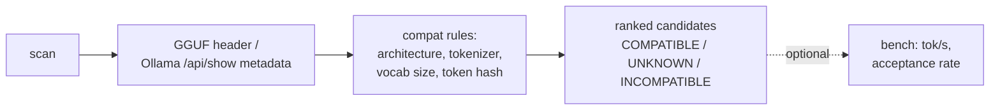

# speculect

[](https://github.com/tsvirov/speculect/actions/workflows/ci.yml)
[](LICENSE)
[](pyproject.toml)

Automatically pairs a small local "draft" model with your target model for
speculative decoding — picks the best available match from what you already
have pulled in Ollama, no manual trial-and-error.

**Stop guessing which draft model to pair with your target — let speculect find it.**

## Try it in 60 seconds

No Ollama, no llama.cpp, no network — runs entirely against fixture GGUF
files built by the same byte-builder the test suite uses.

```bash
git clone https://github.com/tsvirov/speculect.git
cd speculect
python3 -m venv .venv && .venv/bin/pip install -e .
PATH=".venv/bin:$PATH" ./examples/demo.sh
```

Real captured output: [examples/README.md](examples/README.md).

## The problem

Speculative decoding gives a real 2-3x speedup on consumer hardware — a
small "draft" model proposes several tokens ahead, the "target" model
verifies them in one batched pass. But llama.cpp and vLLM don't help you
*pick* a compatible draft/target pair: same architecture, same tokenizer,
same vocab, small enough to be fast. Get the pairing wrong and you either
get a hard error or silent zero speedup. Today that's found by manual trial
and error. speculect automates that lookup against whatever models you
already have pulled in Ollama or sitting in a directory of GGUF files.

## How it works



1. **scan** — read model metadata, either by parsing GGUF file headers
   directly (`--gguf-dir`) or by querying a running Ollama server's
   `/api/tags` + `/api/show`.
2. **compat** — apply four rules in order: matching `architecture`,
   matching `tokenizer.ggml.model`, equal vocab size, and (when both sides
   expose it) a matching hash of the first 256 vocabulary tokens. Any
   candidate missing the metadata to decide gets an honest `UNKNOWN`, never
   a guessed `COMPATIBLE`.
3. **rank** — compatible candidates are also checked against a size
   heuristic (draft should be roughly ≤ 1/6th of target's parameter count)
   and sorted COMPATIBLE → UNKNOWN → INCOMPATIBLE.
4. **bench** *(optional)* — measure baseline vs. speculative tokens/sec and
   acceptance rate, either via a real `llama-speculative`/`llama-server`
   binary or `--mock` for a dry run.

## Before / after

**Before:** pull a handful of models into Ollama, guess which one might work
as a draft, run llama.cpp, get a cryptic vocab-mismatch error or a spec-decode
run that's no faster than baseline, try another model.

**After:**

```
$ speculect pair --target target-7b.gguf --gguf-dir examples/fixtures
target: target-7b.gguf

[COMPATIBLE] draft-500m.gguf — architecture, tokenizer, vocab size, and token hash all match
[INCOMPATIBLE] incompatible-arch.gguf — architecture mismatch: target='llama' draft='gemma'
```

One command, ranked candidates, a reason for every verdict.

## Install

```bash
pip install speculect
```

Or from source:

```bash
git clone https://github.com/tsvirov/speculect.git
cd speculect
pip install -e .
```

Requires Python 3.9+.

## CLI usage

```
speculect scan [--gguf-dir DIR] [--base-url http://localhost:11434]
speculect pair --target <model> [--gguf-dir DIR] [--base-url URL]
speculect bench --target X --draft Y [--mock] [--prompt TEXT]...
speculect --version
```

- `speculect scan` — list every model found, with architecture, tokenizer,
  vocab size, and parameter count.
  - `--gguf-dir DIR` — scan a directory of `.gguf` files instead of
    querying Ollama.
  - `--base-url URL` — Ollama server URL (default `http://localhost:11434`).
- `speculect pair --target <model>` — rank every other found model as a
  candidate draft for `<model>`, with a verdict (`COMPATIBLE` /
  `INCOMPATIBLE` / `UNKNOWN`) and reason for each. Same `--gguf-dir` /
  `--base-url` options as `scan`.
- `speculect bench --target X --draft Y` — run a benchmark for a chosen
  pair.
  - `--mock` — use deterministic fake numbers instead of a real llama.cpp
    binary (this is what `examples/demo.sh` uses).
  - `--prompt TEXT` — a prompt to benchmark with; repeatable. Defaults to
    one built-in prompt if omitted.
- `speculect --version` — print the installed version.

Exit codes: `0` success, `1` no compatible draft candidates found, `2`
infrastructure error (Ollama unreachable and no `--gguf-dir` given, or no
llama.cpp binary found for a non-mock `bench`).

## Comparison

vLLM and llama.cpp both already implement speculative decoding — speculect
does not replace either inference engine. What it adds is the auto-pairing
step neither one has: telling you *which* draft model, out of what you
already have on disk, is actually compatible with your target, and why.

## Limitations

- Ollama itself does not execute speculative decoding — you still need
  llama.cpp (`llama-speculative` or `llama-server`) for a real speedup.
  speculect's role is picking the pair, not running inference.
- Acceptance rate depends heavily on prompt domain; the `bench` command's
  numbers are a directional benchmark, not a guarantee for your workload.
- `UNKNOWN` verdicts on models with sparse metadata are a deliberate design
  choice in favor of honesty over a confident-looking wrong guess — not a
  bug to be silenced.

## Roadmap (not yet implemented)

- vLLM runner support alongside llama.cpp.
- Auto-download of a missing draft model, with explicit user consent.
